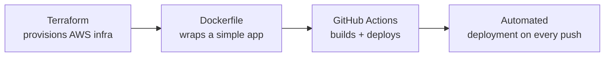
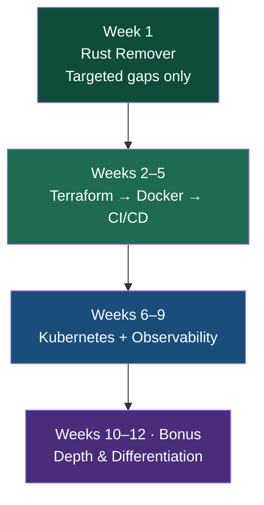

# 🚀 CloudOps / SysOps — 12-Week Upskilling Roadmap

> Personalised plan · Assessment score **45/50**
> Linux **85%** · Networking **87%** · AWS **100%**
> Month 1 skipped · Starting at Week 1

| ⏱️ Daily Time | 🧪 Practice | 🧰 Tool Limit | 📦 Delivery | 🧠 Method | 💬 Focus |
| --- | --- | --- | --- | --- | --- |
| 1.5–2 hrs/day | Hands-on lab every day | Max 3 tools per month | Everything on GitHub | First principles always | One topic per chat |

---

## 📑 Table of Contents

- [Week 1 — Rust Remover (Targeted Only)](#week-1--rust-remover-targeted-only)
- [Weeks 2–5 — Modern Ops Toolchain](#weeks-25--modern-ops-toolchain)
- [Weeks 6–9 — Kubernetes + Observability](#weeks-69--kubernetes--observability)
- [Weeks 10–12 (Bonus) — Depth & Differentiation](#weeks-1012-bonus--depth--differentiation)
- [Roadmap at a Glance](#roadmap-at-a-glance)

---

## Week 1 — Rust Remover (Targeted Only)

**3 hrs total · Only the 5 things you missed · Then close the book on Month 1 forever**

> 💡 Don't re-study everything. Study only what you got wrong. Your brain already knows the rest — drilling things you know is wasted time.

### Linux Edge Cases (1 hr)

- [ ] `ulimit` & open file descriptors
- [ ] Sticky bit behaviour
- [ ] Hard link vs symlink internals

### Networking Gaps (1 hr)

- [ ] ARP & Layer 2 refresher
- [ ] Stateful vs stateless firewall detail

### Hands-On (1 hr)

- [ ] SSH into EC2, set ulimits
- [ ] Create hard link + symlink, break the symlink
- [ ] Set up a Security Group + NACL side by side

✅ **Done.** Month 1 is closed. Move on Monday.

---

## Weeks 2–5 — Modern Ops Toolchain

**Terraform → Docker → CI/CD · One tool at a time · Hands-on every single day**

> 💡 This is the section that feels most "alien." The concepts aren't hard — the terminology is. Give it 3 days per tool before judging whether you understand it.

### Terraform — Weeks 2–3

- [ ] What IaC solves
- [ ] State file & providers
- [ ] `terraform init` / `plan` / `apply`
- [ ] Write a VPC + EC2 in HCL
- [ ] Variables, outputs, modules
- [ ] Remote state on S3

### Docker — Week 4

- [ ] Image vs container vs registry
- [ ] `docker build` / `run` / `push`
- [ ] Write a Dockerfile
- [ ] Docker Compose basics
- [ ] Push image to ECR

### CI/CD — Week 5

- [ ] Pipeline stages: build → test → deploy
- [ ] GitHub Actions
- [ ] Secrets & env vars
- [ ] Trigger on git push

#### 🏗️ Project

> Terraform provisions AWS infra → Dockerfile wraps a simple app → GitHub Actions pipeline builds + deploys it automatically on every push.

✅ **End of Week 5:** you have a real automated deployment pipeline. This alone puts you ahead of many candidates.

---

## Weeks 6–9 — Kubernetes + Observability

**The skill that commands the highest premium in CloudOps right now**

> 💡 K8s will feel like drinking from a firehose for the first week. That's expected. Focus on the mental model — pods, deployments, services — before touching anything advanced.

### Kubernetes Fundamentals — Weeks 6–8

- [ ] Pods, Deployments, ReplicaSets
- [ ] Services (ClusterIP, NodePort, LoadBalancer)
- [ ] ConfigMaps & Secrets
- [ ] Namespaces & resource limits
- [ ] `kubectl` (get, describe, logs, exec, apply)
- [ ] Write YAML manifests by hand
- [ ] EKS or local `kind` cluster
- [ ] Rolling deploys & rollbacks

### Observability — Week 9

- [ ] Metrics vs logs vs traces
- [ ] CloudWatch Logs Insights
- [ ] CloudWatch alarms & dashboards
- [ ] Prometheus + Grafana basics

#### 🏗️ Project

> Deploy the app from Week 5 onto a K8s cluster. Add liveness probes, resource limits, alerting. Simulate a node failure. Recover. Document the runbook.

✅ **End of Week 9:** you can deploy, monitor, and recover a containerised workload on Kubernetes. **That's IC-level.**

---

## Weeks 10–12 (Bonus) — Depth & Differentiation

**You have a full extra month because Month 1 is gone · Go deeper, not wider**

> 💡 Pick **one or two** — not all. Depth in one area beats surface knowledge across five.

| 🧱 Infrastructure & GitOps | ☁️ AWS & Cloud Depth |
| --- | --- |
| Helm charts | AWS Lambda basics |
| ArgoCD / GitOps | Cost optimisation in AWS |

| 🔐 Security | 🎓 Certification |
| --- | --- |
| Kubernetes RBAC | AWS Solutions Architect SAA-C03 |
| Pod Security Standards | |

✅ **End of Week 12:** 3 portfolio projects + depth in one specialisation. Strong IC story for interviews.

---

## Roadmap at a Glance

| Phase | Weeks | Theme | Outcome |
| --- | --- | --- | --- |
| 1 | Week 1 | Rust Remover | Close gaps from assessment, move on |
| 2 | Weeks 2–5 | Terraform → Docker → CI/CD | Automated deployment pipeline |
| 3 | Weeks 6–9 | Kubernetes + Observability | Deploy, monitor, recover on K8s (IC-level) |
| 4 | Weeks 10–12 | Depth & Differentiation | 3 portfolio projects + one specialisation |

---

> 🎯 **Good luck. You've got this.**
> Update your context doc after every completed week.
