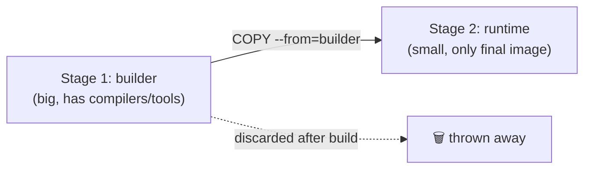
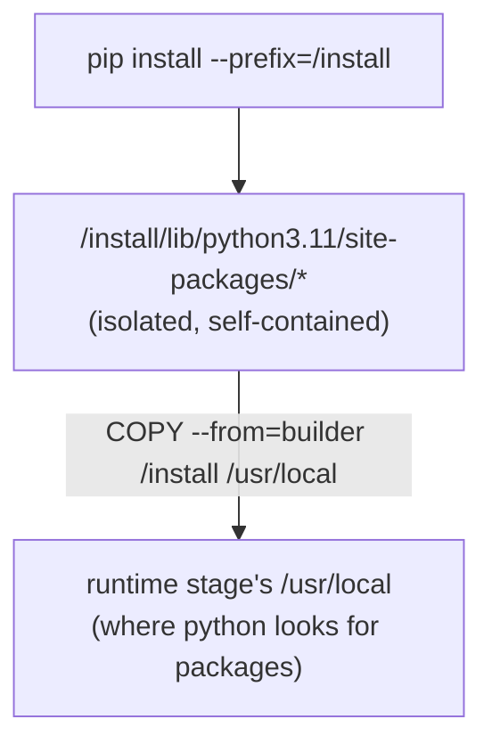

# 2a · Multi-Stage Docker Builds — Why, How, When

> **Goal:** understand what multi-stage builds actually buy you, and when they don't — via a real bug traced in a training repo.

[← The Dockerfile](./02-dockerfile.md) · [Index](../README.MD) · Next: [Core Workflow →](./03-workflow.md)

---

## 📑 Table of Contents

- [What Is a Multi-Stage Build?](#what-is-a-multi-stage-build)
- [Why Use One?](#why-use-one)
- [Anatomy of a Multi-Stage Dockerfile](#anatomy-of-a-multi-stage-dockerfile)
- [Case Study: A Multi-Stage Build That Didn't Shrink the Image](#case-study-a-multi-stage-build-that-didnt-shrink-the-image)
- [When Multi-Stage Actually Saves Size (and When It Doesn't)](#when-multi-stage-actually-saves-size-and-when-it-doesnt)
- [Mental Model](#mental-model)
- [Summary](#summary)

---

## What Is a Multi-Stage Build?

A normal Dockerfile has **one `FROM`** — everything you `RUN` and `COPY` piles up in one image, including tools you only needed *during the build* (compilers, dev headers, source code, caches).

A multi-stage Dockerfile has **more than one `FROM`**. Each `FROM` starts a fresh, independent stage. You do the heavy lifting (compiling, installing) in an early stage, then `COPY --from=<stage>` only the *finished artifacts* into a final, clean stage. Everything else — the compiler, the source, the intermediate junk — is discarded when the build finishes, because only the last stage becomes the actual image.



---

## Why Use One?

**Problem it solves:** installing/building software often needs tools you don't want in production.

| Example | Build-time need | Runtime need |
|---|---|---|
| Go app | `golang` compiler (~800 MB) | just the compiled binary |
| C extension (e.g. `psycopg2` from source) | `gcc`, `libpq-dev` | the compiled `.so` file |
| Node app (TypeScript) | `typescript`, `devDependencies` | just the compiled `dist/` JS |

Shipping the compiler to production is wasted space **and** a bigger attack surface (more tools an attacker could abuse if they get a shell in your container).

Multi-stage builds let you say: *"build with everything, ship with nothing extra."*

---

## Anatomy of a Multi-Stage Dockerfile

```dockerfile
# ─── Stage 1: builder ─────────────────────
FROM golang:1.22 AS builder
WORKDIR /src
COPY . .
RUN go build -o /out/app ./cmd/app

# ─── Stage 2: runtime (tiny) ───────────────
FROM gcr.io/distroless/base-debian12
COPY --from=builder /out/app /app
ENTRYPOINT ["/app"]
```

| Piece | What it does |
|---|---|
| `FROM golang:1.22 AS builder` | Names this stage `builder` so it can be referenced later. |
| `FROM gcr.io/distroless/base-debian12` | Starts a **new, unrelated** image — none of the builder's layers carry over automatically. |
| `COPY --from=builder /out/app /app` | Reaches back into the (soon to be discarded) `builder` stage and pulls out just the compiled binary. |

Final image = the binary + a minimal base. No compiler, no source, often **10–20× smaller**.

---

## Case Study: A Multi-Stage Build That Didn't Shrink the Image

In `gha-test-repo` we had a single-stage `dockerfile` and a `Dockerfile.multistage` meant to replace it. After converting, the image size barely moved. Tracing it top to bottom found **three separate bugs**, plus one structural reason the savings were small even once fixed.

### The single-stage version

```dockerfile
FROM python:3.11-slim
WORKDIR /app
COPY requirements.txt .
RUN pip install --no-cache-dir -r requirements.txt
COPY . .
EXPOSE 5000
CMD ["python", "app.py"]
```

### The multi-stage version (as found — broken)

```dockerfile
FROM python:3.11 AS builder
WORKDIR /builder
COPY requirements.txt .
RUN pip install --no-cache-dir -r requirements.txt        # ← bug 2

FROM python:3.11-slim AS runtime
WORKDIR /app
COPY --from=builder /install /usr/local                   # ← bug 2 (continued)
COPY app.py .                                              # ← bug 3
RUN useradd --no-create-home appuser
USER.appuser                                                # ← bug 1
EXPOSE 8000
CMD ["python", "app.py"]
```

**Bug 1 — build fails outright.**
`USER.appuser` (missing space) is not a valid instruction. `docker build` errors immediately:

```
ERROR: dockerfile parse error on line 22: unknown instruction: USER.appuser
```

Whatever image was being size-compared wasn't actually produced by this file.

**Bug 2 — the artifact hand-off is broken.**
The comment says *"install into an isolated directory"*, but the `RUN pip install` line never tells pip to do that — it installs into the builder's normal system path. Then `COPY --from=builder /install /usr/local` tries to copy a folder (`/install`) that was never created, and the build fails there too.

Fix: tell pip explicitly where to put things, using `--prefix`:

```dockerfile
RUN pip install --no-cache-dir --prefix=/install -r requirements.txt
```



`--prefix=/install` makes pip write packages into `/install/...` instead of the system location. That gives `COPY --from=builder` a real, predictable folder to grab. The destination, `/usr/local`, is where the runtime stage's own Python already searches for installed packages — so the copied files are picked up automatically, no extra config needed.

**Bug 3 — missing files.**
`COPY app.py .` only copies one file. The app calls `render_template("index.html", ...)`, which needs the `templates/` folder — never copied. The single-stage version's `COPY . .` copied everything, so this only broke after "optimizing" the copy list. Fix:

```dockerfile
COPY app.py .
COPY templates/ templates/
```

### Result after fixing all three

| Image | Size |
|---|---|
| single-stage | 260 MB |
| multi-stage (fixed) | 243 MB |

Only ~7% smaller — not the dramatic drop multi-stage builds are known for. See next section for why.

---

## When Multi-Stage Actually Saves Size (and When It Doesn't)

The size win comes from **discarding build-only tooling**. If there was never much build-only tooling to discard, there's not much to save.

```
   Compiled deps (C extensions built from source, Go, Rust, TypeScript)
       ► builder stage needs gcc / headers / compiler toolchain
       ► runtime stage discards all of it
       ► BIG savings (100s of MB, sometimes GB)

   Pure-Python / pre-built wheel deps (Flask, psycopg2-binary, requests, etc.)
       ► builder stage doesn't need a compiler at all
       ► there's nothing bulky being discarded
       ► SMALL savings (mostly just pip's own cache/download overhead)
```

In this case study, both stages already used `python:3.11-slim`, and `requirements.txt` (`flask`, `psycopg2-binary`) installs from **pre-built wheels** — no compiler ever ran. The single-stage image was never carrying compiler bloat, so there was nothing large for the multi-stage split to remove.

**Rule of thumb:** multi-stage builds pay off proportionally to how much build-only tooling your dependencies require. Check with:

```bash
# does your build stage actually need dev headers / a compiler?
grep -E "gcc|build-essential|-dev" Dockerfile
```

If your `requirements.txt` / `package.json` deps are all pre-built binaries, expect single-digit percent savings from multi-stage alone — the win there is mainly **security** (no compiler in prod) and **cleanliness**, not size.

---

## Mental Model

Think of it like packing for a trip vs. shipping the workshop:

| 🧳 Analogy | Docker Concept |
|---|---|
| The workshop with all your tools | `builder` stage |
| Building/assembling the item in the workshop | `RUN go build`, `RUN pip install`, etc. |
| Packing only the finished item into your suitcase | `COPY --from=builder ...` |
| Leaving the whole workshop behind | builder stage discarded, doesn't exist in final image |
| A suitcase that's already light because you only brought a toothbrush anyway | pure-wheel/pre-built deps — nothing heavy was ever in the workshop to leave behind |

---

## Summary

| Question | Answer |
|---|---|
| What is it? | A Dockerfile with 2+ `FROM` stages; only the last stage ships. |
| Why use it? | Keep build-only tools (compilers, dev headers, source) out of the final image. |
| Key instruction | `COPY --from=<stage-name> <src> <dst>` |
| Common bug | Copying a path from the builder that was never actually created there (e.g. forgetting `--prefix`/`--target` on `pip install`). |
| Common bug | Narrowing `COPY` in the final stage and forgetting a file/folder the app needs at runtime. |
| When it saves the most | Compiled languages / C-extension deps built from source. |
| When it saves little | Pure-Python or pre-built-wheel dependencies — there's no compiler bloat to strip out. |
| Verify, don't assume | Always `docker build` the file and check it actually succeeds before comparing sizes — a build that silently fails isn't the image you think you're comparing. |

---

Next: [**Core Workflow →**](./03-workflow.md)
