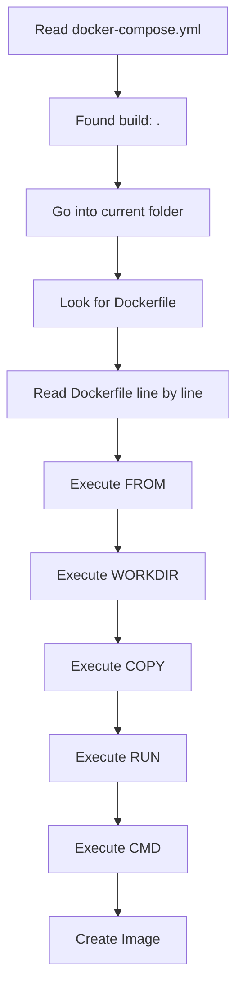
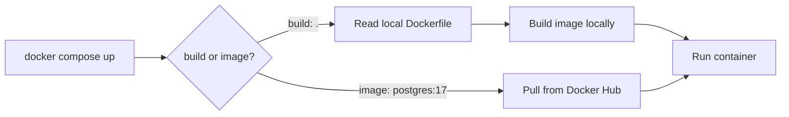
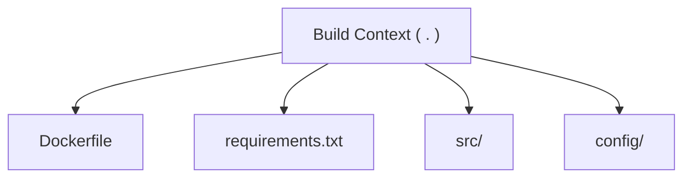
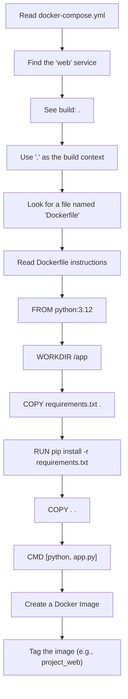
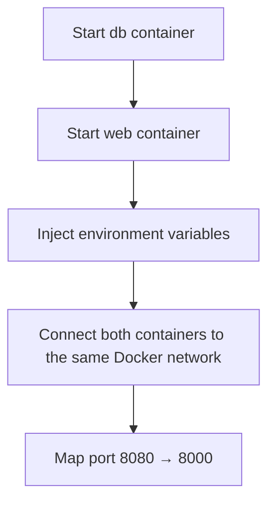

# How Docker Compose Works

A deep-dive into what happens internally when Docker Compose builds images and runs containers.

---

## 📑 Table of Contents

- [Step 1: Project Structure](#step-1-project-structure)
- [Step 2: What is Docker Looking For?](#step-2-what-is-docker-looking-for)
- [Step 3: Where Are the Instructions?](#step-3-where-are-the-instructions)
- [Step 4: Internal Flow of `docker compose build`](#step-4-internal-flow-of-docker-compose-build)
- [Step 5: What if the Dockerfile Has Another Name?](#step-5-what-if-the-dockerfile-has-another-name)
- [Step 6: What if There is NO Dockerfile?](#step-6-what-if-there-is-no-dockerfile)
- [Step 7: Difference Between `build` and `image`](#step-7-difference-between-build-and-image)
- [Step 8: Build Context](#step-8-build-context)
- [Step 9: Relationship Between Compose and Dockerfile](#step-9-relationship-between-compose-and-dockerfile)
- [Step 10: Complete Lifecycle](#step-10-complete-lifecycle)
- [Summary](#summary)

---

## Step 1: Project Structure

Suppose your project looks like this:

```text
project/
│
├── docker-compose.yml
├── Dockerfile
├── app.py
├── requirements.txt
└── templates/
```

---

## Step 2: What is Docker Looking For?

Compose sees:

```yaml
build: .
```

The `.` means **current directory**. So Docker starts searching for a file named `Dockerfile` inside that directory.

---

## Step 3: Where Are the Instructions?

The instructions come from the `Dockerfile`.

Example project layout:

```text
project/
│
├── docker-compose.yml
└── Dockerfile
```

`Dockerfile`:

```dockerfile
FROM python:3.12

WORKDIR /app

COPY requirements.txt .

RUN pip install -r requirements.txt

COPY . .

CMD ["python", "app.py"]
```

These instructions are what Docker executes during the build.

> **Note:** The compose file itself does not contain build instructions — it only tells Docker *where* to find them.

---

## Step 4: Internal Flow of `docker compose build`

When you run:

```bash
docker compose build
```

internally, Docker does something like this:



So the compose file is simply pointing Docker to the directory that contains the Dockerfile.

---

## Step 5: What if the Dockerfile Has Another Name?

Suppose your files are:

```text
project/
├── Dockerfile.dev
└── docker-compose.yml
```

Then:

```yaml
services:
  web:
    build:
      context: .
      dockerfile: Dockerfile.dev
```

Now Compose resolves the build like this:

| Setting      | Value            | Meaning                                   |
| ------------ | ---------------- | ------------------------------------------ |
| `context`    | `.`              | Current folder is used as the build context |
| `dockerfile` | `Dockerfile.dev` | Used instead of the default `Dockerfile`   |

---

## Step 6: What if There is NO Dockerfile?

Imagine this layout:

```text
project/
├── docker-compose.yml
└── app.py
```

No `Dockerfile` exists.

Running:

```bash
docker compose build
```

produces an error similar to:

```text
failed to solve:
failed to read dockerfile:
open Dockerfile: no such file or directory
```

because Compose doesn't know how to build an image.

---

## Step 7: Difference Between `build` and `image`

Your compose file currently has:

```yaml
web:
  build: .
```

This means Docker will **build an image locally**.

For your database, you have:

```yaml
db:
  image:
```

Normally it should be:

```yaml
db:
  image: postgres:17
```

Here Docker does not build anything — instead it pulls the image from Docker Hub and runs a container from it.



| Aspect                  | `build: .`             | `image: postgres:17`      |
| ------------------------ | ----------------------- | -------------------------- |
| Image source              | Built locally            | Pulled from Docker Hub     |
| Requires a Dockerfile     | Yes                      | No                         |
| Build time on `up`/`build`| Yes                      | No (just a download/pull)  |
| Typical use case          | Your own application     | Off-the-shelf services (DB, cache, etc.) |

There is no Dockerfile involved for the `db` service unless you explicitly build your own PostgreSQL image.

---

## Step 8: Build Context

This is another important concept.

Suppose your project is:

```text
project/
├── Dockerfile
├── docker-compose.yml
├── requirements.txt
├── src/
└── config/
```

When you write:

```yaml
build: .
```

the **build context** is everything inside the current directory:



So this Dockerfile instruction:

```dockerfile
COPY . .
```

copies everything from the build context into the image.

---

## Step 9: Relationship Between Compose and Dockerfile

Think of them as having different responsibilities.

| Docker Compose              | Dockerfile                    |
| ---------------------------- | ------------------------------ |
| Defines services              | Defines how to build an image  |
| Creates containers            | Creates the image              |
| Connects networks             | Installs packages              |
| Mounts volumes                | Copies files                   |
| Sets environment variables    | Sets the working directory     |
| Maps ports                    | Defines the startup command    |

---

## Step 10: Complete Lifecycle

Suppose your project contains:

```text
project/
├── docker-compose.yml
├── Dockerfile
├── app.py
└── requirements.txt
```

### Build phase — `docker compose build`



### Run phase — `docker compose up`



---

## Summary

In this guide, we've walked through the essential steps of how Docker Compose works under the hood — from the project structure, to how Compose locates and reads the Dockerfile, to the full build and run lifecycle. You should now have a comprehensive understanding of Docker Compose's internal workings.
