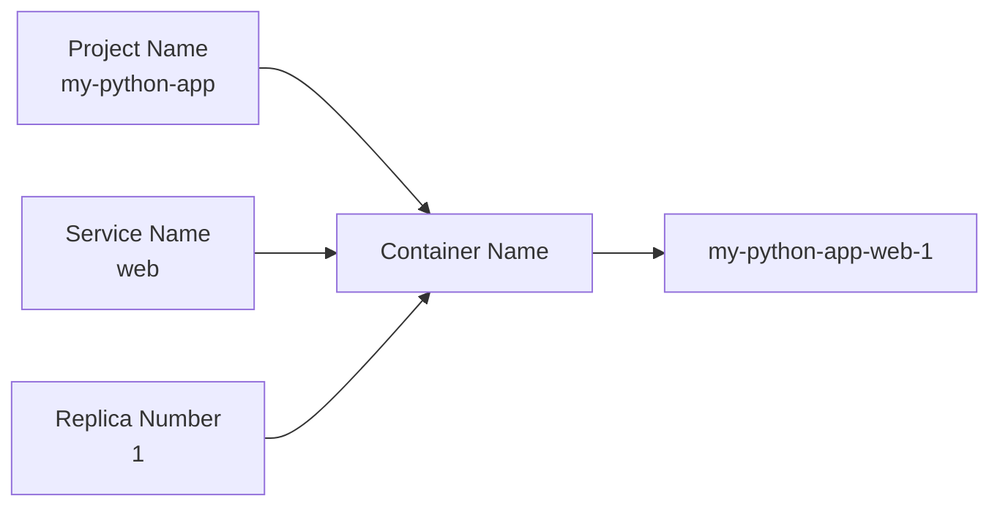
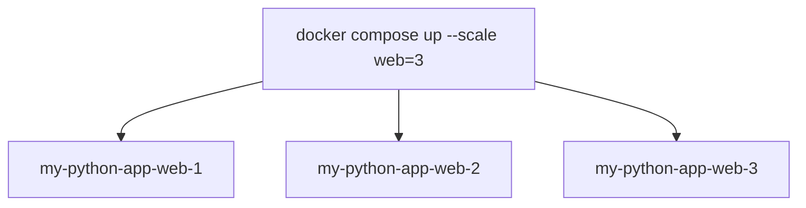
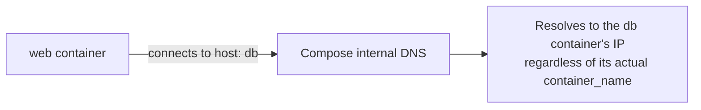

# Docker Compose — Container Naming & DNS Resolution

Docker Compose automatically generates names for containers, networks, and volumes based on the **project name**, **service name**, and **instance (replica) number**. Let's see how it works.

---

## 📑 Table of Contents

- [Example Project](#example-project)
- [The Naming Pattern](#the-naming-pattern)
- [Why "-1"? Scaling Services](#why--1-scaling-services)
- [Viewing Containers with `docker ps`](#viewing-containers-with-docker-ps)
- [Where Does the Project Name Come From?](#where-does-the-project-name-come-from)
- [Changing the Project Name](#changing-the-project-name)
- [Giving a Fully Custom Container Name](#giving-a-fully-custom-container-name)
- [Why `container_name` Is Usually Avoided](#why-container_name-is-usually-avoided)
- [How Do Containers Communicate?](#how-do-containers-communicate)
- [Summary](#summary)
- [Mental Model — The Apartment Building](#mental-model--the-apartment-building)

---

## Example Project

Suppose your project structure is:

```text
my-python-app/
│
├── docker-compose.yml
├── Dockerfile
└── app.py
```

And your compose file is:

```yaml
services:
  web:
    build: .

  db:
    image: postgres:17
```

Now run:

```bash
docker compose up -d
```

**What names does Docker Compose generate?**

Assume your folder name is `my-python-app`. Compose treats this as the **project name**.

---

## The Naming Pattern

Compose builds every container name from three parts:

```text
<Project Name>-<Service Name>-<Replica Number>
```



So the final container names become:

| Service | Generated Container Name |
| --- | --- |
| `web` | `my-python-app-web-1` |
| `db`  | `my-python-app-db-1`  |

---

## Why "-1"? Scaling Services

The trailing number exists to support **scaling**. Suppose you scale your application:

```bash
docker compose up --scale web=3
```



All three are identical containers — the number is simply what distinguishes them.

---

## Viewing Containers with `docker ps`

```bash
docker ps
```

Example output:

| CONTAINER ID | NAMES |
| --- | --- |
| `ab12cd34` | `my-python-app-web-1` |
| `ef56gh78` | `my-python-app-db-1`  |

---

## Where Does the Project Name Come From?

By default, **Docker Compose uses the current directory name** as the project name.

Example:

```text
/home/vishal/devops-training/
```

Project name becomes:

```text
devops-training
```

Containers become:

```text
devops-training-web-1
devops-training-db-1
```

---

## Changing the Project Name

Yes — the project name can be overridden in three ways.

**1. The `-p` flag** (stands for *project*):

```bash
docker compose -p ecommerce up
```

Now containers become:

```text
ecommerce-web-1
ecommerce-db-1
```

**2. An environment variable:**

```bash
COMPOSE_PROJECT_NAME=ecommerce
docker compose up
```

**3. A `.env` file:**

```env
COMPOSE_PROJECT_NAME=ecommerce
```

---

## Giving a Fully Custom Container Name

Yes — use `container_name`:

```yaml
services:
  web:
    container_name: my-web-server
    build: .

  db:
    container_name: postgres-db
    image: postgres:17
```

Now:

```bash
docker compose up
```

creates `my-web-server` and `postgres-db` instead of `my-python-app-web-1`.

---

## Why `container_name` Is Usually Avoided

> 💬 This is a common interview question.

Imagine you want three web containers.

**Without `container_name`:**

```bash
docker compose up --scale web=3
```

Docker creates `web-1`, `web-2`, `web-3` — everything works.

**With `container_name: my-web-server`:**

Docker tries to create `my-web-server` three times. This is impossible because **container names must be unique**, so scaling fails:

```text
Conflict.
Container name "/my-web-server" is already in use.
```

That's why `container_name` is generally **not recommended** unless you have a specific reason (such as integrating with legacy scripts or tools that expect a fixed name).

---

## How Do Containers Communicate?

Suppose your compose file is:

```yaml
services:
  web:
    build: .

  db:
    image: postgres:17
```

Your application connects using:

```text
postgresql://appuser:apppass@db:5432/appdb
```

Notice the hostname is **`db`** — not `my-python-app-db-1`.

**Why?** Docker Compose automatically creates an internal DNS entry using the **service name**.



Inside the Compose network, the service name `db` always resolves to the correct container IP, regardless of the actual container name.

So your application should connect to `db`, **not** `my-python-app-db-1`. This is why changing `container_name` usually doesn't affect how services communicate with each other.

---

## Summary

| Concept | Example |
| --- | --- |
| Project name | `my-python-app` (defaults to folder name) |
| Service name | `web`, `db` |
| Default container name | `my-python-app-web-1` |
| Change project name | `docker compose -p ecommerce up` |
| Fixed container name | `container_name: my-web-server` |
| Hostname used by other containers | Service name (`db`, `web`) |
| Recommended for inter-container communication | Use the **service name**, not the container name |

---

## Mental Model — The Apartment Building

Think of Docker Compose like an apartment building:

| 🏢 Building Analogy | Docker Compose Concept | Example |
| --- | --- | --- |
| The building | Project name | `ecommerce` |
| The apartment type | Service name | `web`, `db` |
| The apartment number | Container/replica number | `1`, `2`, `3` |
| The full apartment label | Container name | `ecommerce-web-1` |

Inside the building, everyone refers to the database by its **service name** (`db`), not by its full apartment label (`ecommerce-db-1`). This service-name-based DNS is what makes Docker Compose networking simple and reliable.
