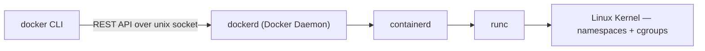
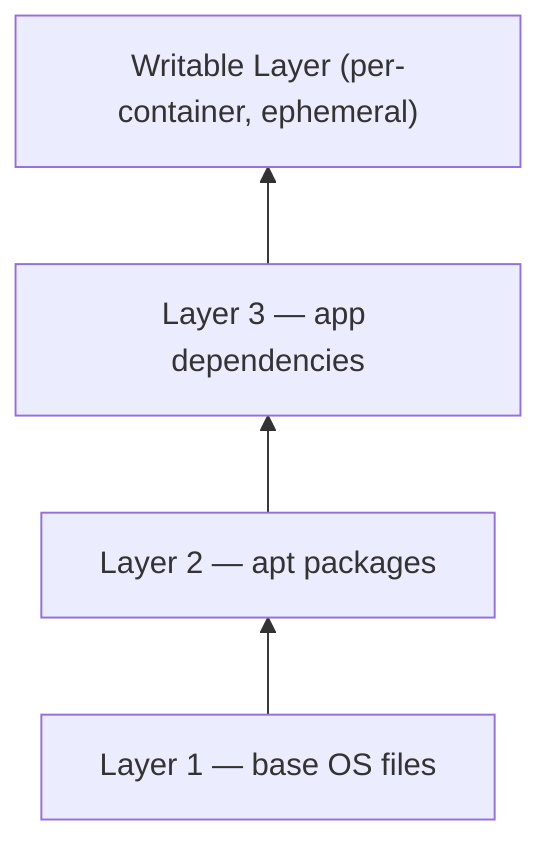
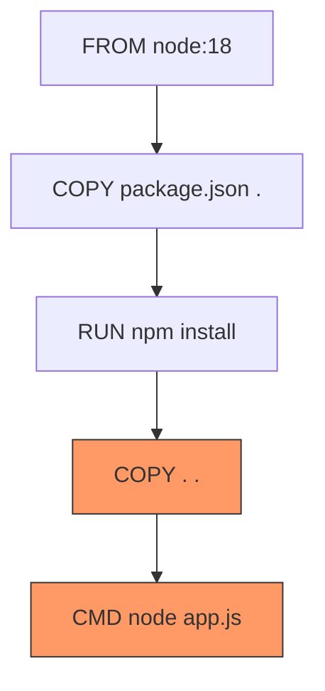
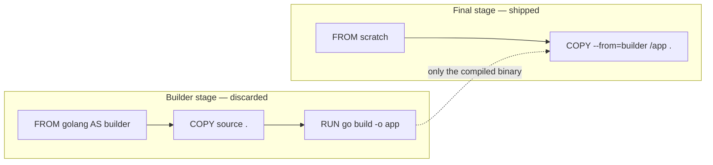
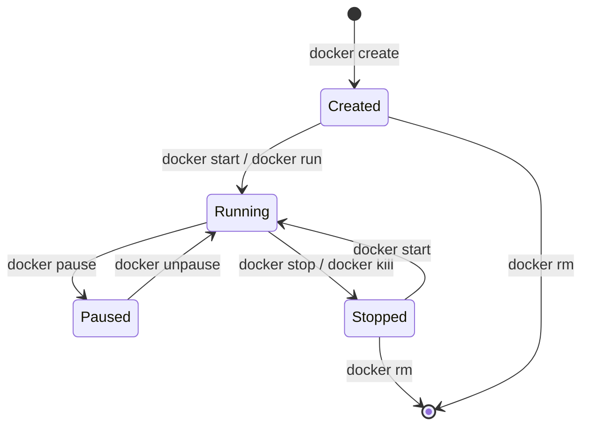
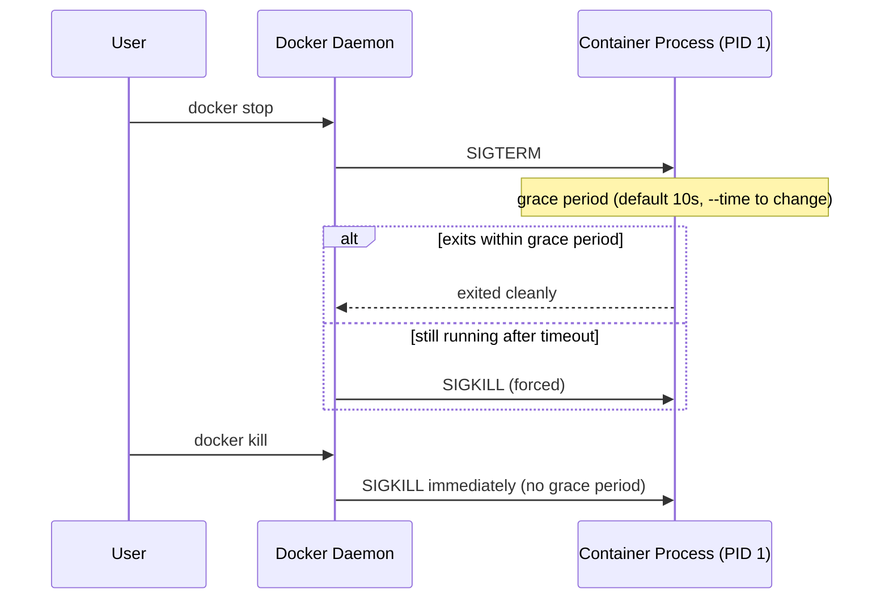
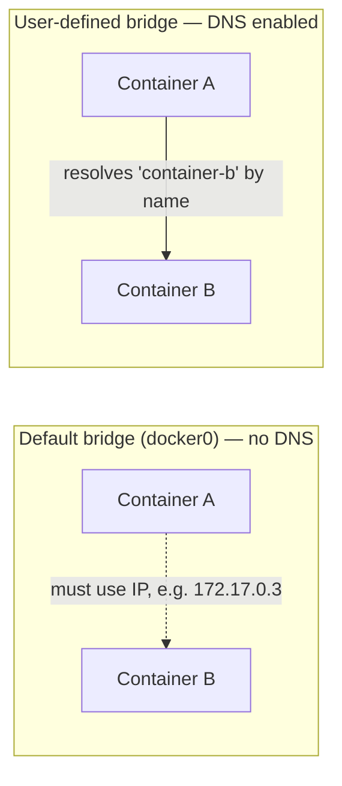
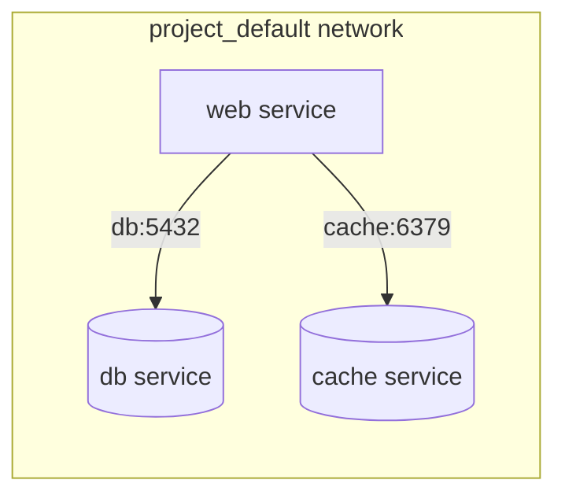
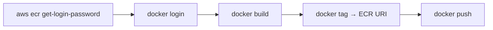

# Docker Interview Q&A

A categorized, cleaned-up reference of Docker interview questions, ordered the way you'd actually learn the topic — architecture first, then images, Dockerfiles, runtime, storage, networking, Compose, security, and finally AWS ECR / CI.

## Table of Contents

1. [Docker Architecture & Fundamentals](#1-docker-architecture--fundamentals)
2. [Images, Layers & the Build Cache](#2-images-layers--the-build-cache)
3. [Writing Effective Dockerfiles](#3-writing-effective-dockerfiles)
4. [Container Lifecycle & Runtime Management](#4-container-lifecycle--runtime-management)
5. [Volumes & Data Persistence](#5-volumes--data-persistence)
6. [Networking](#6-networking)
7. [Docker Compose](#7-docker-compose)
8. [Security & Hardening](#8-security--hardening)
9. [AWS ECR & CI/CD](#9-aws-ecr--cicd)
10. [Debugging & Troubleshooting](#10-debugging--troubleshooting)
11. [Appendix: Related Git Commands](#11-appendix-related-git-commands)

---

## 1. Docker Architecture & Fundamentals

#### Q1. What is the Docker daemon (`dockerd`) responsible for?
**A:** `dockerd` is the server-side component that does all the heavy lifting: building images, managing the container lifecycle, and handling volumes and networks. The Docker CLI (`docker`) is just a client that sends REST API calls to the daemon over a Unix socket at `/var/run/docker.sock`.



#### Q2. How do you inspect the actual Linux VM Docker runs on when using Docker Desktop on a Mac?
**A:**
```bash
docker run --rm -it --privileged --pid=host justincormack/nsenter1
```
This drops you into the actual Linux VM. `uname -a` will show the Linux kernel. `exit` to leave.

#### Q3. What Linux kernel features underpin container isolation?
**A:** Two kernel primitives do all the work — no hypervisor, no hardware emulation. This is why containers start in milliseconds.

| Primitive | Purpose | Examples isolated/limited |
|---|---|---|
| **Namespaces** | Isolate *what a process can see* | Filesystem, network, PID tree, hostname, IPC, user IDs |
| **Cgroups** | Limit *how much a process can consume* | CPU, memory, disk I/O, network bandwidth |

A container is simply a process with namespace restrictions and cgroup limits applied.

---

## 2. Images, Layers & the Build Cache

#### Q4. How can you check how many layers a Docker image has?
**A:**
```bash
docker image history ubuntu:22.04
```
`history` shows every layer in the image — what instruction created it, how big it is. The bottom layers (oldest) are the OS foundation. This is the layer cache you work with every time you write a Dockerfile.

#### Q5. What is a Union File System (UnionFS) and why does Docker use it?
**A:** UnionFS (e.g., OverlayFS) lets Docker stack multiple read-only image layers and mount one writable layer on top, per container. Multiple containers sharing the same base image don't duplicate those layers on disk — they share them, saving significant storage and speeding up pulls.



#### Q6. Two Docker images both use `FROM ubuntu:22.04` as their base. What happens on disk?
**A:** Docker's layer cache is content-addressed. If two images share the same base layer (same SHA256), that layer is stored once on disk and referenced by both. This is a key space and bandwidth optimization — pulling a new image that shares layers with an existing one only downloads the diff.

#### Q7. Why does layer order matter in a Dockerfile?
**A:** Docker's build cache is sequential: change a layer and every layer after it is re-executed. Put rarely-changing steps (`FROM`, package installs) early; put frequently-changing steps (`COPY` source code) late.

#### Q8. Under what exact condition does Docker invalidate a layer's cache?
**A:** Cache invalidation is triggered by:
1. The instruction string itself changing, or
2. For `COPY`/`ADD`, the checksum of the copied files changing (Docker checksums actual file content, not timestamps).

Once any layer is invalidated, **all subsequent layers must be rebuilt** — this is why order matters so much.

#### Q9. Why should you `COPY package.json` and run `npm install` *before* copying the rest of the source code?
**A:** If you `COPY . .` first and then run `npm install`, any change to any source file invalidates the install layer and `npm install` reruns from scratch. By copying only `package.json` first, the install layer stays cached until `package.json` changes — which is rare. Source code changes only invalidate the cheaper `COPY . .` layer.


*Orange = re-run on every source change. `npm install` (green path above) stays cached.*

#### Q10. You run `docker save` and `docker export` on the same container. What is the difference?
**A:**

| Command | What it produces | Includes history/layers? | Restore with |
|---|---|---|---|
| `docker save myimage > image.tar` | Full image export | Yes — all layers, metadata, tags | `docker load` |
| `docker export mycontainer > container.tar` | Flattened container filesystem | No — single layer, no history | `docker import` |

`save` is for moving images between systems without a registry. `export` is useful for forensics or building minimal base images.

---

## 3. Writing Effective Dockerfiles

#### Q11. What is the key difference between `COPY` and `ADD` in a Dockerfile?
**A:**

| Instruction | Local files | Remote URLs | Auto-extracts archives |
|---|---|---|---|
| `COPY` | ✅ | ❌ | ❌ |
| `ADD` | ✅ | ✅ | ✅ |

Prefer `COPY` unless you specifically need `ADD`'s extra behavior — it's more predictable.

#### Q12. In a Dockerfile, what happens when you specify both `ENTRYPOINT` and `CMD`?
**A:** `ENTRYPOINT` sets the fixed executable (e.g. `["python"]`). `CMD` provides default arguments to that executable (e.g. `["app.py"]`). Together they run `python app.py`.

| Scenario | Resulting command |
|---|---|
| `ENTRYPOINT ["python"]` + `CMD ["app.py"]` | `python app.py` |
| Same, run with `docker run image train.py` | `python train.py` (CMD replaced, ENTRYPOINT intact) |

This pattern lets you ship a container with a sensible default but allow overrides at runtime.

#### Q13. What does `FROM scratch` mean in a Dockerfile?
**A:** `FROM scratch` is Docker's empty starting point — literally nothing: no libc, no shell, no package manager. You `COPY` in your statically-compiled binary and that's the entire image. Go and Rust programs compiled statically work perfectly with `FROM scratch`, producing images often under 10MB with zero OS attack surface.

#### Q14. What is the primary benefit of a multi-stage Docker build?
**A:** Multi-stage builds let you compile/build in a "fat" image (with compilers, test tools, SDKs) then `COPY --from=builder` only the final artifact into a minimal runtime image. A Go app that needs the full Go toolchain to compile can ship as a 10MB `scratch` image — the compiler never touches the final image.



#### Q15. What is a `.dockerignore` file and what are the two main reasons to use it?
**A:** The build context (everything Docker sends to the daemon before building) includes your entire directory by default. `.dockerignore` excludes paths from it.

1. **Speed** — don't send `node_modules`, `.git`, or test fixtures to the daemon.
2. **Security** — `.env` files, SSH keys, and credentials must not accidentally land in an image layer.

#### Q16. How many `CMD` instructions can a Dockerfile have, and what happens if you include multiple?
**A:** You can write multiple `CMD` instructions, but only the **last one** takes effect — earlier ones are silently ignored. The same rule applies to `ENTRYPOINT`. This is a common gotcha: someone adds a `CMD`, then later adds another intending to override it, not realizing the first is now dead code. Keep **one `CMD` per Dockerfile**.

#### Q17. What does `EXPOSE` do in a Dockerfile?
**A:** `EXPOSE` is documentation metadata. It tells humans (and tools like Compose) which ports the app expects to use, but it doesn't actually open or publish anything. To make a port accessible from outside the container you need `-p 8080:8000` at `docker run` time, or `ports:` in Compose. **`EXPOSE` without `-p` = no external access.**

#### Q18. What is the difference between `ARG` and `ENV` in a Dockerfile?
**A:**

| | `ARG` | `ENV` |
|---|---|---|
| Available during `docker build`? | ✅ | ✅ |
| Available in the running container? | ❌ | ✅ |
| Visible via `docker inspect` on the image? | ❌ | ✅ |
| Good for | Build-time config (version pins) | Runtime app configuration |
| Secrets-safe? | Still avoid for secrets | Never — appears in inspect/layers |

#### Q19. What is a distroless image?
**A:** Distroless images (from Google) contain only the application runtime (e.g., glibc, OpenSSL) and your app — no bash, no `apt`, no `ls`, no `curl`. This drastically reduces attack surface: an attacker who gets code execution inside the container has almost no tools to pivot with. The trade-off is harder debugging — there's no shell to exec into.

---

## 4. Container Lifecycle & Runtime Management

#### Q20. You run `docker run ubuntu:22.04` and the container exits immediately. What is the most likely reason?
**A:** A container lives as long as its PID 1 (the main process) is running. The `ubuntu` base image has no `CMD` that runs a long-lived foreground process — it drops you to `bash`, but without an interactive terminal (`-it`) or a command, `bash` exits immediately. **No PID 1 running = container exits.**

#### Q21. Why does PID 1 matter inside a Docker container?
**A:** PID 1 is responsible for reaping zombie processes and handling signals. If your app isn't designed to be PID 1, signals like `SIGTERM` may be ignored and zombie processes accumulate.

#### Q22. What does the `--init` flag do when running a container?
**A:** `docker run --init` injects `tini` as PID 1. Tini is a tiny init process that:
1. Forwards signals (`SIGTERM`, `SIGINT`) to the child process correctly.
2. Reaps zombie processes that the child spawns and doesn't wait for.

Without `--init`, your app *is* PID 1 and must handle these itself — most apps don't. `--init` is a cheap, simple way to get correct signal handling without modifying your Dockerfile.

#### Q23. What is the difference between `docker run` and `docker start`?
**A:** `docker run` = create + start a brand new container from an image. `docker start` = restart an already-created (stopped) container by its ID or name. When you `docker stop` a container, it still exists (`docker ps -a` shows it); `docker start` brings it back up with the same config. `docker run` always creates something new.



#### Q24. What is the difference between `docker stop` and `docker kill`?
**A:**



`docker stop` sends `SIGTERM` first — a polite shutdown signal that well-behaved apps handle to flush buffers and close connections — then `SIGKILL` after the grace period. `docker kill` goes straight to `SIGKILL` (or any signal specified with `-s`) — immediate, no cleanup.

#### Q25. How do you configure a container to restart automatically if it crashes?
**A:**
```bash
docker run --restart=always   # or: on-failure, unless-stopped
```

#### Q26. What is the difference between `docker logs` and `docker events`?
**A:** `docker logs` tails the stdout/stderr of a specific container's main process — your application's output. `docker events` streams Docker daemon events: container started, stopped, died, image pulled, network connected, volume mounted, etc. Use `logs` to debug your app; use `events` to audit what Docker itself is doing or to trigger automation on lifecycle changes.

#### Q27. How do you set a memory limit on a Docker container?
**A:** `docker run --memory=512m` sets a hard cgroup memory limit. If the container tries to exceed it, the kernel OOM killer fires and terminates the process — you'll see `OOMKilled` in `docker inspect`. Also set `--memory-swap` equal to `--memory` to prevent swap use. In Compose: `mem_limit: 512m`. **Always set memory limits in production** to prevent a runaway container from starving the host.

#### Q28. Which of the following is *not* a valid way to pass environment variables into a running container?
**A:** Using `VOLUME` in the Dockerfile with a `.env` path is **not** a valid way — `VOLUME` mounts a filesystem path, it has nothing to do with environment variables. Valid ways include: `-e KEY=value`, `--env-file .env`, `ENV` in the Dockerfile (baked in at build time), and `environment:` / `env_file:` in Compose.

---

## 5. Volumes & Data Persistence

#### Q29. What does container ephemerality mean for data persistence?
**A:** Containers are ephemeral — their writable layer is tied to the container lifecycle. `docker stop`/`start` preserves the writable layer, but `docker rm` destroys it. For data that must survive container removal (databases, uploads, config), use named volumes or bind mounts that exist outside the container.

#### Q30. What is the main difference between a bind mount and a named volume?
**A:**

| | Bind mount | Named volume |
|---|---|---|
| Syntax | `-v /host/path:/container/path` | `-v mydata:/container/path` |
| Managed by | You (specific host path) | Docker (`/var/lib/docker/volumes`) |
| Portable across machines | ❌ | ✅ |
| Best for | Local dev (live code reload) | Production databases, stateful workloads |

#### Q31. What happens to data written inside a container's writable layer when you run `docker rm`?
**A:** `docker rm` deletes the container and its writable layer permanently. Any data written inside the container (outside of volumes or bind mounts) is gone. This is why databases must use named volumes. A common mistake: running a database container without a volume, then doing `docker rm` and losing all data — **always mount volumes for anything stateful.**

---

## 6. Networking

#### Q32. On the default bridge network, how do two containers communicate with each other?
**A:** This is a subtle gotcha: the default bridge network (`docker0`) does **not** provide automatic DNS resolution by container name — you must use container IP addresses, which change on restart. User-defined bridge networks *do* support DNS by name. For any multi-container setup where containers need to find each other by name, create a custom network or use Docker Compose (which creates one automatically).



#### Q33. What does `--network host` do and why is it a security concern?
**A:** `--network host` removes network isolation entirely — the container uses the host's network stack directly. A service binding to port 8080 inside the container is accessible on host port 8080 with no port mapping. **Security concern:** the container can reach any service on the host (including localhost-only services like metadata endpoints) and scan the host's network. Use only when absolutely necessary for performance-critical workloads.

#### Q34. In a `docker-compose.yml`, what does `ports: - "8080:8000"` mean?
**A:** The format is `HOST:CONTAINER`. `8080:8000` means traffic arriving at host port 8080 is forwarded to container port 8000. Your app inside the container listens on 8000 (matching `EXPOSE 8000` or the `CMD`), and you `curl` it from the host at `localhost:8080`. **Getting this backwards is a very common mistake.**

---

## 7. Docker Compose

#### Q35. What core problem does Docker Compose solve?
**A:** Compose solves the multi-container coordination problem. A web app + database + cache requires three `docker run` commands with the right networks, volumes, env vars, and dependency ordering. Compose captures all of that in `docker-compose.yml` so `docker compose up --build` brings up the entire stack in one command with correct wiring. It's a **local dev and CI tool, not a production orchestrator.**

#### Q36. How do Compose services communicate with each other by default?
**A:** Compose automatically creates a user-defined bridge network for the project. Every service gets a DNS entry equal to its service name — so a `web` service can reach `db:5432`, no IP addresses or inter-service port mapping needed. This is why a Compose `DATABASE_URL` looks like `postgresql://db:5432/mydb` — `db` resolves automatically on the Compose network.



#### Q37. What does `depends_on` actually guarantee in Docker Compose?
**A:** `depends_on` only guarantees **start order**, not readiness. The Postgres container starts before your app container — but Postgres may not be ready to accept connections yet. To truly wait for readiness, add a `healthcheck` on the dependency and `condition: service_healthy` in `depends_on`, or use a `wait-for-it.sh` / `dockerize` script inside your app container.

#### Q38. What is the difference between `docker compose up` and `docker compose up --build`?
**A:** `docker compose up` reuses existing images if they were previously built — even if your source code or Dockerfile changed. `docker compose up --build` forces Docker to rebuild all images before starting containers. **In development,** always use `--build` after code changes. **In CI,** always use `--build` to ensure you're testing the latest version.

#### Q39. What is a Docker Compose override file and when would you use it?
**A:** `docker-compose.override.yml` is automatically merged with `docker-compose.yml` when you run `docker compose up`. Common pattern: the base file has production-style config (no bind mounts, no extra ports exposed), and the override file adds bind mounts for live code reload, debug ports, and dev environment variables. **Keep the override file out of production deployments.**

---

## 8. Security & Hardening

#### Q40. Why should you avoid running containers as root?
**A:** Running as root inside a container is a defence-in-depth failure. Container isolation isn't perfect — kernel vulnerabilities can allow namespace escapes. If your app runs as root and escapes, the attacker has root on the host. Add `USER appuser` to your Dockerfile, create the user with `useradd`, and ensure file permissions allow that user to read the app. A non-root container escape gives only limited user privileges.

#### Q41. What is Docker Content Trust (DCT)?
**A:** DCT (based on The Update Framework / Notary) lets image publishers sign images and lets clients verify those signatures before pulling. `DOCKER_CONTENT_TRUST=1` makes the Docker client refuse to pull unsigned images. This prevents supply chain attacks where a compromised registry serves a malicious image under the correct tag — relevant whenever you need provenance guarantees, especially for base images.

> See also: [distroless images](#q19-what-is-a-distroless-image) and [`--network host`](#q33-what-does---network-host-do-and-why-is-it-a-security-concern) — both are security-relevant choices covered in their primary sections above.

---

## 9. AWS ECR & CI/CD

#### Q42. What is the correct order of steps to push a Docker image to AWS ECR?
**A:**



Authenticate → build → tag → push.

#### Q43. What controls who can push and pull from a private ECR repository?
**A:** ECR access is pure IAM.

| Action | Required permissions |
|---|---|
| **Push** | `ecr:GetAuthorizationToken`, `ecr:BatchCheckLayerAvailability`, `ecr:PutImage`, `ecr:InitiateLayerUpload`, `ecr:UploadLayerPart`, `ecr:CompleteLayerUpload` |
| **Pull** | `ecr:GetAuthorizationToken`, `ecr:BatchGetImage`, `ecr:GetDownloadUrlForLayer` |

In CI (GitHub Actions), grant these permissions to an IAM role assumed via OIDC — no long-lived keys needed.

#### Q44. Why do you need to run `docker tag` before pushing to ECR?
**A:** `docker push` uses the image name to determine the registry destination. An image named `myapp:latest` pushes to Docker Hub. To push to ECR, the image must be tagged with the full ECR URI:
```bash
docker tag myapp:latest <account>.dkr.ecr.<region>.amazonaws.com/myrepo:latest
```
This creates an alias — no data is copied, it's just a pointer to the same image layers.

#### Q45. What does an ECR lifecycle policy do?
**A:** Without lifecycle policies, ECR repositories grow indefinitely and you pay for every stored image layer. Lifecycle policies automatically clean up: delete untagged images older than N days, keep only the last N tagged images, or expire images by prefix. **Set these up from day one** — they prevent surprise storage bills and keep repositories clean.

#### Q46. Which tool is native to AWS for scanning ECR images for OS and package vulnerabilities?
**A:** ECR has built-in image scanning using Clair (basic scanning) or Amazon Inspector (enhanced scanning for deeper vulnerability analysis). You can configure on-push scanning so every image is automatically scanned when pushed. Results appear in the ECR console and can trigger EventBridge rules to fail a pipeline if critical CVEs are found. Third-party alternatives: Trivy, Snyk, Anchore.

---

## 10. Debugging & Troubleshooting

#### Q47. Your container works perfectly locally but fails in CI with a different error. What is your first debugging step?
**A:** The most common local-vs-CI discrepancy is **build context differences**. Locally you might have uncommitted files, different `.env` files, or a `.dockerignore` that behaves differently — CI runs from a clean checkout. Verify:
1. Are the right files committed and present?
2. Does `.dockerignore` exclude anything CI needs?
3. Are environment variables / secrets injected correctly in CI?
4. Is the base image being pulled fresh vs. cached?

#### Q48. Why does build context size matter for CI build times?
**A:** When you run `docker build`, Docker tars the entire build context directory and sends it to the daemon — before it reads a single Dockerfile instruction. A context with `node_modules` (200MB+) or `.git` history means that much data is transferred to the daemon on *every* build, even if the Dockerfile never `COPY`s those files. `.dockerignore` excludes them from the context. In CI, this can mean the difference between a 3-second and a 45-second build startup.

---

## 11. Appendix: Related Git Commands

Notes captured in the same session, not Docker-specific but worth keeping:

```bash
# --rebase puts your local commits on top of whatever is on GitHub cleanly,
# avoiding a messy merge commit.
git pull --rebase

# List all tracked files in git matching a pattern
git ls-files | grep yml
```
