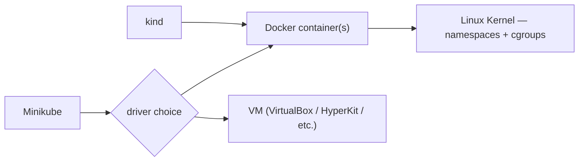
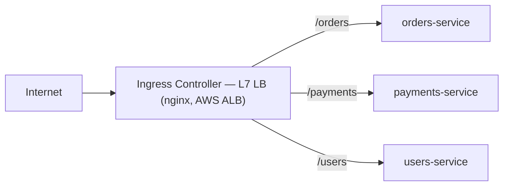
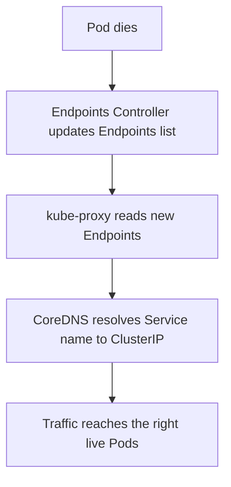

# Kubernetes Interview Q&A

A categorized, cleaned-up reference of Kubernetes interview questions, ordered the way you'd actually learn the topic — local tooling first, then Services & networking, self-healing, namespaces, Ingress, config, manifests, and probes/storage.

## Table of Contents

1. [Local Cluster Tooling](#1-local-cluster-tooling)
2. [Services & Cluster Networking](#2-services--cluster-networking)
3. [Self-Healing: ReplicaSets & Endpoints](#3-self-healing-replicasets--endpoints)
4. [Namespaces & Multi-Environment Isolation](#4-namespaces--multi-environment-isolation)
5. [Ingress](#5-ingress)
6. [ConfigMaps, Encoding & Encryption](#6-configmaps-encoding--encryption)
7. [Writing Manifests](#7-writing-manifests)
8. [Probes: Liveness & Readiness](#8-probes-liveness--readiness)
9. [Storage: PV vs PVC](#9-storage-pv-vs-pvc)

---

## 1. Local Cluster Tooling

#### Q1. What does `kind` run on behind the scenes — Minikube or Docker?
**A:** `kind` (Kubernetes IN Docker) runs each cluster "node" as a Docker container, not a VM. Minikube is a separate, alternative tool that *can* use Docker as one of its drivers but can also run on a VM driver (VirtualBox, HyperKit, etc.). `kind` is Docker-only by design — every control-plane and worker "node" you see with `kubectl get nodes` is actually just a container on your machine.



---

## 2. Services & Cluster Networking

#### Q2. Your Postgres database runs as Pods inside the cluster. It should never be reachable from the internet — only your Flask API Pods should talk to it. Which Service type do you use and why?
**A:** `ClusterIP`. It's the default Service type and only exposes a virtual IP reachable *inside* the cluster — there's no path in from outside. Any Pod in the cluster (like your Flask API) can reach it by Service name; the internet cannot.

#### Q3. What is the difference between a `ClusterIP` and a `NodePort` Service? When would you use each?
**A:**

| Type | Reachable from | Typical use |
|---|---|---|
| **ClusterIP** | Inside the cluster only | Service-to-service traffic, e.g. Flask talking to Postgres |
| **NodePort** | Outside the cluster, via `<NodeIP>:<port>` | Quick external access for local/testing |
| **LoadBalancer** | Outside the cluster, via a cloud LB | Production external access on EKS/GKE/AKS |

A simple way to remember it:
```
ClusterIP    → inside the cluster only
NodePort     → outside access, local/testing
LoadBalancer → outside access, production on cloud
```
In production on EKS you'd use `LoadBalancer` for external access — not `NodePort`.

#### Q4. You have two Services in different namespaces: `payment-service` in `payments`, `order-service` in `orders`. How does `order-service` reach `payment-service`?
**A:** Using Kubernetes' internal DNS naming convention:
```
<service-name>.<namespace>.svc.cluster.local
```
```
http://payment-service.payments.svc.cluster.local:5000
```

#### Q5. Three microservices — `auth`, `orders`, `payments` — run in the cluster. `orders` needs to call `auth`, which lives in a different namespace called `platform`. What URL does `orders` use?
**A:**
```
http://auth-service.platform.svc.cluster.local:<port>
```

#### Q6. Right now you have 5 different apps, each exposed via `NodePort` — that's 5 different ports (`30080`, `30081`, `30082`...) to manage. How could a single entry point route traffic to the right app based on URL path?
**A:** You need an L7 load balancer that inspects the HTTP host/path in the request and routes accordingly — that's exactly what an **Ingress** is.



One entry point, many apps behind it — no more juggling 5 NodePort numbers. Your Services stay as `ClusterIP` (internal only); the Ingress is the only thing exposed externally.

---

## 3. Self-Healing: ReplicaSets & Endpoints

#### Q7. When a Pod dies and a new one spawns with a different IP, what component updates the Service's Endpoints list with the new IP?
**A:** The **Endpoints Controller**, which runs inside the Controller Manager. It watches Pod health continuously and updates the Endpoints list whenever a Pod is added, deleted, or fails its health check. `kube-proxy` then reads those updated Endpoints.



#### Q8. You have a Deployment with 3 replicas running. You delete one Pod manually. What happens, and which component is responsible?
**A:** A new Pod is spawned to bring the count back to 3 — the **ReplicaSet** (owned by the Deployment) is responsible for that. Separately, the **Endpoints Controller** in the Controller Manager updates the Service's Endpoints list to include the new Pod's IP.

---

## 4. Namespaces & Multi-Environment Isolation

#### Q9. You need to deploy the same application to three environments — dev, staging, and production — on the same cluster. What object isolates them from each other?
**A:** **Namespace**. Each environment gets its own namespace, giving you separate DNS scoping (`svc.<namespace>.svc.cluster.local`), separate RBAC boundaries, and separate resource quotas, all on one physical cluster.

---

## 5. Ingress

#### Q10. What is the difference between an Ingress Resource and an Ingress Controller?
**A:** They are not the same thing.

| | What it is |
|---|---|
| **Ingress Resource** | The YAML you write — the routing rules |
| **Ingress Controller** | The actual software that reads those rules and performs the routing (nginx, AWS ALB Controller, Traefik, etc.) |

Kubernetes ships with the Ingress Resource API but **no controller** — you must install one separately, or nothing will act on your Ingress rules.

#### Q11. What is the purpose of the `rewrite-target` annotation in an Ingress resource? Why do you need it?
**A:** Without it, a request to `/orders` is forwarded to `orders-service` with the *full path* `/orders` intact. Your app inside the Pod is usually listening on `/`, not `/orders` — so it returns 404.

```
Without rewrite:   /orders  → Pod receives /orders  → 404
With rewrite:      /orders  → Pod receives /        → 200
```
`rewrite-target: /` strips the matched path prefix before forwarding, so the app receives just `/` and responds correctly.

---

## 6. ConfigMaps, Encoding & Encryption

#### Q12. A Flask Pod reads `DB_HOST` from a ConfigMap as an environment variable. You update the ConfigMap. What do you need to do for the app to see the new value, and why?
**A:** Delete the Pods and let them be recreated (e.g. via a rollout restart). Environment variables are injected **once**, at container start — the values are read from the ConfigMap and frozen into the process environment at that moment. A live ConfigMap update does not propagate to an already-running Pod's env vars.

#### Q13. What is the difference between encoding and encryption?
**A:** Encryption is designed to keep data **secret and secure** from unauthorized access. Encoding is designed to change data **formatting** for compatibility and system usability. Encryption requires a secret key to reverse the process; encoding relies on publicly available algorithms and needs no key to decode.

| | Encryption | Encoding |
|---|---|---|
| Purpose | Confidentiality | Format compatibility |
| Reversible without a key? | No | Yes — publicly known algorithm |
| Common algorithms | AES, RSA, Blowfish | Base64, ASCII, URL Encoding, Unicode |

> **Base64 is not encryption — it's encoding.** Anyone can decode it:
> ```bash
> echo "bXlwYXNzd29yZA==" | base64 --decode
> # outputs: mypassword
> ```
> This is exactly why raw `Secret` manifests (which store values as base64) are **not** secure at rest by themselves — base64 only hides values from a casual glance, it does not protect them.

> **Note:** YAML and JSON are strictly text-based formats and cannot natively handle raw binary data without breaking or corrupting the file — another reason Kubernetes Secrets base64-encode binary/sensitive values before embedding them in a manifest.

---

## 7. Writing Manifests

#### Q14. What is the use of `---` (three hyphens) when writing a manifest file with multiple objects?
**A:** In YAML, `---` acts as a **document separator**. It lets you define multiple distinct Kubernetes objects in a single manifest file — like a page break telling the parser to treat everything above and below it as separate configurations (e.g. a Deployment and a Service in one `app.yaml`).

---

## 8. Probes: Liveness & Readiness

#### Q15. What is the difference between Liveness and Readiness probes?
**A:**

| Probe | Question it answers | On failure |
|---|---|---|
| **Liveness** | "Is this Pod still healthy?" | Kill the Pod and restart it |
| **Readiness** | "Is this Pod ready to receive traffic?" | Remove the Pod from Service Endpoints (no restart) |

Three ways to define either probe:

| Type | How it checks success |
|---|---|
| **HTTP** | Hits an endpoint; success = 200–399 response |
| **TCP** | Checks if a port is open |
| **Exec** | Runs a command inside the container; success = exit code 0 |

#### Q16. A Flask app hits a deadlock — the process is still running, the port is still open, but every request hangs forever. Kubernetes shows the Pod as `Running`. What probe detects this, how, and what action does Kubernetes take?
**A:** The **liveness probe**, by checking the app's HTTP endpoint on its port. Since the deadlocked app never responds within the timeout, the probe fails — Kubernetes kills the Pod and restarts it.

#### Q17. You deploy a new version via a rolling update. Two seconds in, a new Pod starts but the app inside it is still initialising. Which probe prevents Kubernetes from sending live traffic to that Pod, and how?
**A:** The **readiness probe**. It checks the Service endpoint/port and, until it succeeds, keeps the Pod **out** of the Service's Endpoints list — no traffic is routed to it. Once the app finishes initialising and the probe passes, the Pod is added back to Endpoints and starts receiving traffic.

---

## 9. Storage: PV vs PVC

#### Q18. What is the difference between a PersistentVolume and a PersistentVolumeClaim? Who creates each one in a production team?
**A:**

| | What it represents | Who typically creates it |
|---|---|---|
| **PersistentVolume (PV)** | The actual storage that exists (an EBS volume, NFS share, etc.) | The admin / infra team (or dynamically via a StorageClass) |
| **PersistentVolumeClaim (PVC)** | A request for storage made by an app | The app developer, in their Deployment/StatefulSet manifest |

The PVC is bound to a matching PV, and the Pod mounts the PVC — the app never talks to the PV directly.
